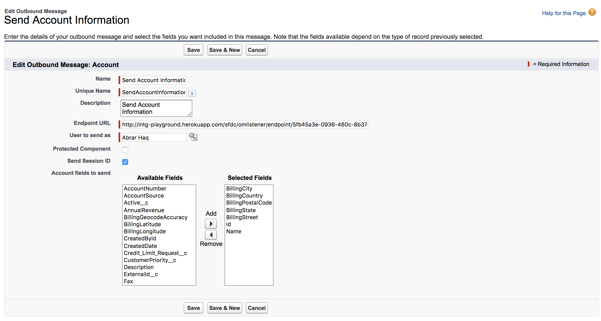
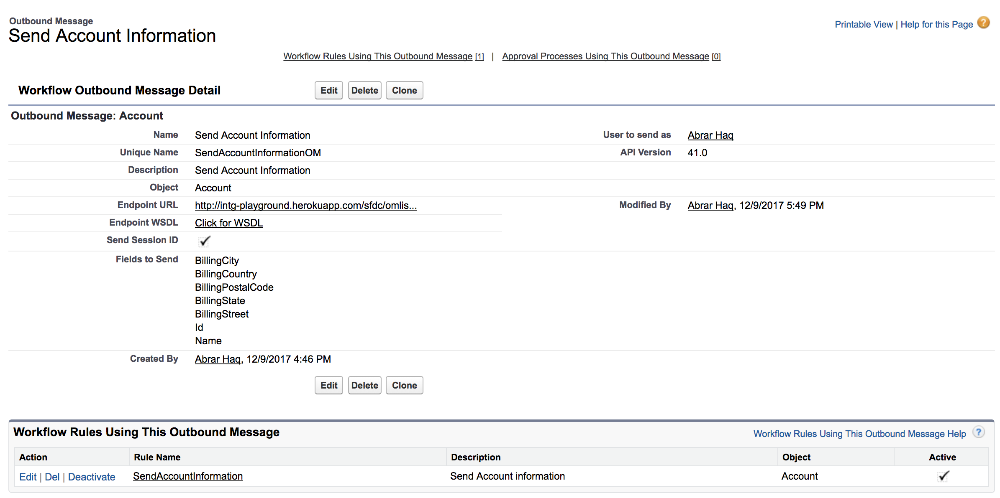
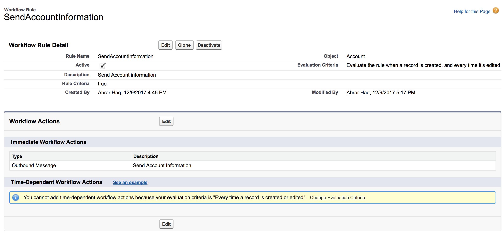
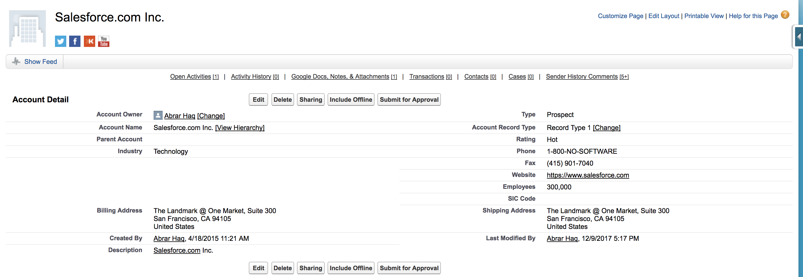

# Salesforce Outbound Message

Here you will find the following details about Salesforce Outbount Message.
<ol type="1">
<li>What is a Salesforce Outbound Message?</li>
<li>Setup an Endpoint</li>
<li>How to setup a Salesforce Outbound Message?</li>
<li>How to test a Salesforce Outbound Message?</li>
<li>How to Monitor a Salesforce Outbound Message?</li>
</ol>

## (1) What is a Salesforce Outbound Message?
<ol type="a">
<li>Salesforce outbound message allows you to specify fields that changes within Salesforce and send those fields to a designated external endpoint/server without writing a single line of code.</li>
<li>It is a declarative (point and click) feature and does not need any programmatic skills.</li>
<li>It uses Asynchronous communication.</li>
<li>It uses SOAP(WSDL) protocol.</li>
<li>It creates response in XML data format.</li>
<li>It resides under Automation Tool.</li>
<li>It is part of Workflow Rules and Approval Processes.</li>
<li>Salesforce has a special permission "Send Outbound Messages" on Profile and Permission Sets. This permission allows user to send outbound messages to an external Web service API.</li>
</ol>

## (2) Setup an Endpoint
<ol type="a">
<li>You can create a Listener in any programming language (e.g. Java, .Net, PHP etc.). In other words you setup an endpoint where the Salesforce Outbound Message will send the message in XML.</li>
<li>For Testing purpose you can use following publicly available services. Most of them are free!
<ul>
<li>Integration Playground by Salesforce (http://intg-playground.herokuapp.com/sfdc/omlistener)</li>
<li>PutsReq (http://putsreq.com/)</li>
<li>RequestBin (https://requestb.in/)</li>
<li>PostBin (http://postb.in/)</li>
<li>SOAP UI (On-Premise, Need to download the software to use it.)</li>
<li>Burp Suite (https://security.secure.force.com/security/tools/webapp/burpabout)</li>
<li>Runscope (https://www.runscope.com/)</li>
</ul>
</li>
</ol>

## (3) How to setup a Salesforce Outbound Message?
<ol type="a">
<li>Create an Outbound Message</li>
Go to = Setup > App Setup > Workflow & Approvals > Outbound Messages
  

<li>Create a Workflow Rule "or" an Approval Process</li>
Create a workflow rule "or" an approval process and add an Outbound Message as an action.

</ol>

## (4) How to test a Salesforce Outbound Message?
<ol type="a">
<li>Here in this example, an Account record has been used to test the Outbound Message</li>
<li></li>
</ol>

## (5) How to Monitor a Salesforce Outbound Message?
<ol type="a">
<li>Go to = Setup > Administration Setup > Monitoring > Outbound Messages</li>
<li></li>
</ol>
